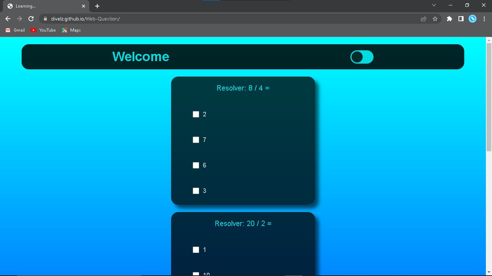
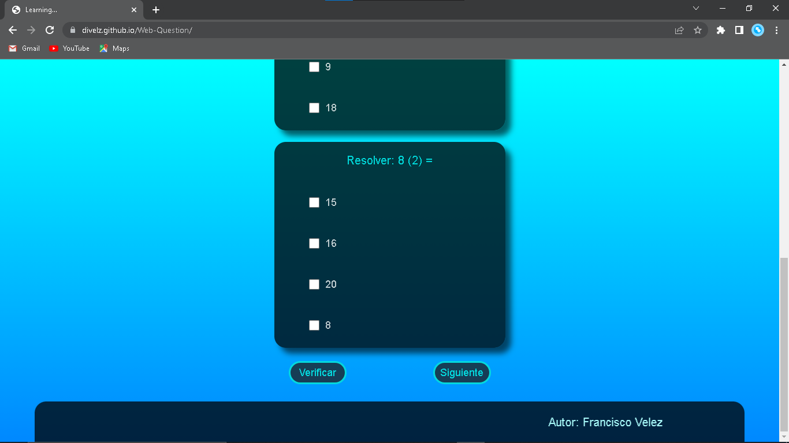
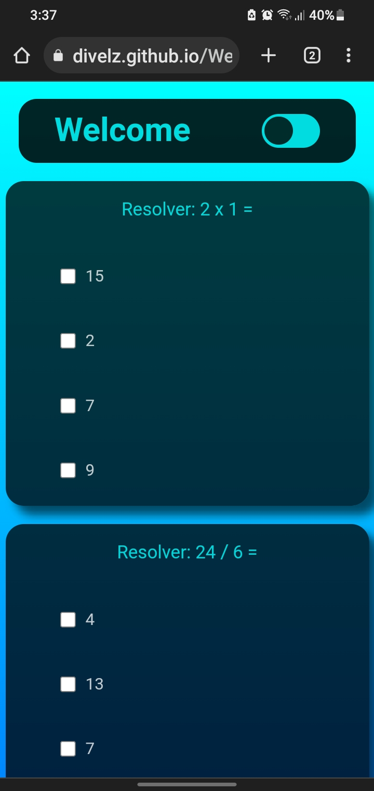
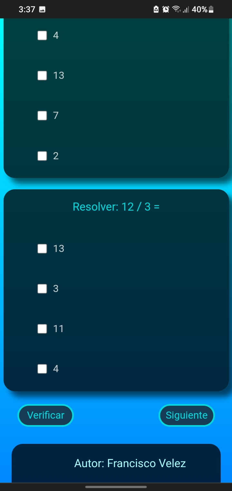

# Web-Question

#3 Project on the web using Html, Css, Javascript. Question fields.

* Color change button.
* Various fields of options.
* Verify button.
* Next button for new questions.
* At the end it has the name of the author.
* etc...

**Image 1**

**Image 2**

**Image 3**

**Image 4**

link: [Go to the website.](https://fravelz.github.io/Web-Question/)

**Best regard !!!**

<cite>Author: Francisco Velez</cite>
